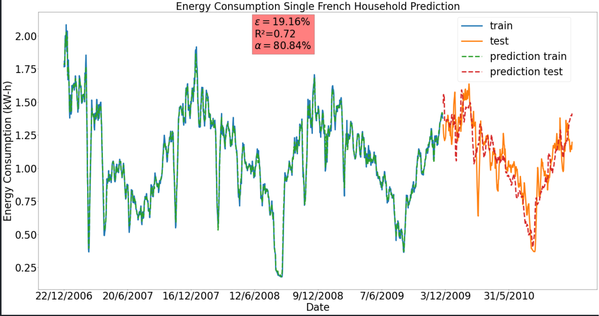

# Final Result

# Motivation
- Understand the basics of time-series prediction.
- Prediction of energy power consumption of single-household one year ahead based on previous three years of electric energy consumption.
# Data source
- Original data source: [click here](https://archive.ics.uci.edu/ml/datasets/individual+household+electric+power+consumption)
